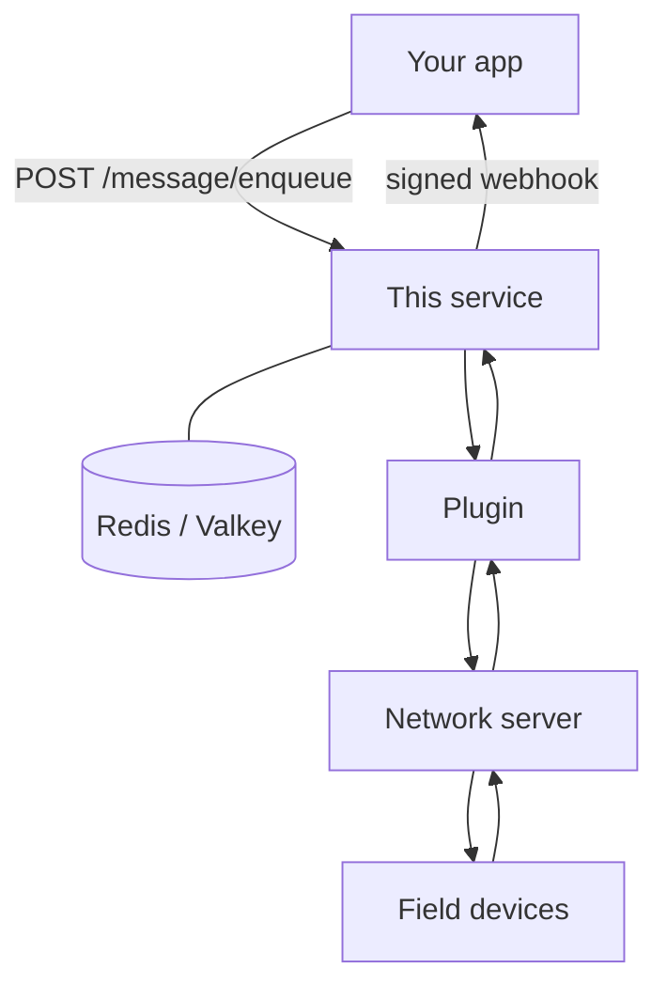

# NXT Device Messaging

**Reliable, prioritized, retrying command delivery to addressable field devices.**

Give it a command for a device; it takes responsibility for getting it there. The service queues the command, dispatches it through whichever network server that device speaks to, tracks it through each delivery stage, retries with exponential backoff when a stage fails, and reports the outcome over a signed webhook.

Your billing or operations app should not have to speak ChirpStack, a CALIN HTTP API, or STS token formatting, and it should not have to implement radio-aware retries itself.
You POST a job, keep the `correlationId` you chose, and this service owns delivery until it can tell you the result.

Hardware is plugged in as **plugins**.
First-party today: CALIN over HTTP (V1 and V2), CALIN over ChirpStack (LoRaWAN), nxt-sts for STS token minting, and stub plugins so you can exercise the API without a vendor.
Each delivery plugin is one of two patterns:

- **PUSH** — we send the command; the network server calls us back (typical of LoRaWAN).
- **PULL** — we create a task on a vendor HTTP API and poll it for status.

Redis (or Valkey) is the only other process you need. There is no relational database.
Jobs, retries, and in-flight state live there, so a restart does not drop the queue.

## What this is not

Not a notification, SMS, or chat system.
A "message" here is a command or read addressed to a physical device — read a meter's voltage, deliver a credit token, set a power limit.

## How it fits together

You talk to this service. This service talks to the field. Those are two different conversations.

Your app uses HTTP: enqueue a command, look it up, cancel it, or mint a token.
When something worth telling you happens (first send, success, failure, or the device spoke first), we POST a signed JSON event to a URL you configure.
How to implement that: [integrating](docs/guides/integrating.md).
Live shapes: `/swagger` on a running instance.
TypeScript/Zod types: [`@nxtgrid/device-messaging-contract`](packages/contract/README.md).

On the other side, a plugin speaks the vendor or radio protocol.
You never speak LoRaWAN from your app — choose the plugin for that meter and enqueue with that `pluginId` ([which plugin](#plugins)).
You never receive ChirpStack (or other network-server) callbacks in your app — those hit `POST /ingress/:pluginId` here, and we turn them into the same webhook events.



A command goes down that stack and the outcome comes back up the same path: service ↔ plugin ↔ network server ↔ field devices.
Redis sits next to the service; it is storage, not a hop on the radio path.
The plugin is on every send and every result. The network server is what actually reaches the devices.

Minting an STS token (`POST /token/generate`, or the `nxt-sts` plugin) is separate from delivering one.
Mint is synchronous: you get a 20-digit string back on the HTTP response, nothing is queued, and there is no delivery webhook.
Putting that token onto a meter is still an enqueue (`DELIVER_PREEXISTING_TOKEN`, or a plugin that mints then delivers).

## Status

The command API, ingress, outbound webhook, metrics, and first-party plugins are in place.
Pin image tags when you deploy.
Design rationale lives in [`docs/architecture/`](docs/architecture/).
Parked work: [`docs/decisions-log.md`](docs/decisions-log.md).

## Run it locally

This path uses the **stub** plugins: no vendor credentials, no radio.
You will see a command accepted and moved off the queue. You will not reach a real meter.

You need **Node.js 24.x**, **pnpm 11** (via [Corepack](https://nodejs.org/api/corepack.html): `corepack enable`), and **Docker** to run Valkey.

Fastest path: compose **only** Valkey, run this service on the host.

```bash
corepack enable
pnpm install
cp .env.example .env   # REDIS_HOST=127.0.0.1, stubs via DEVICE_MESSAGING_CONFIG_PATH
docker compose up -d valkey
pnpm dev
```

Listens on **`PORT`** (default **3100**). `.env` loads via `--env-file` on `pnpm dev` / `pnpm start`.

Confirm it is up, then enqueue a dummy read.
`correlationId` is yours — use it to look the job up afterwards.
`pluginId` must match a plugin in the config (here the stub).

```bash
curl -sS http://127.0.0.1:3100/healthz
# {"ok":true}

curl -sS -X POST http://127.0.0.1:3100/message/enqueue \
  -H "Authorization: Bearer dev-key" \
  -H "Content-Type: application/json" \
  -d '{
    "commandType": "READ_CREDIT",
    "priority": 1,
    "pluginId": "stub-push",
    "networkId": 42,
    "correlationId": "demo-1",
    "device": { "type": "ELECTRICITY_METER", "externalReference": "m-1" }
  }'
```

Wait a second (the engine ticks once a second), then:

```bash
curl -sS http://127.0.0.1:3100/message/demo-1
```

You should see the job in flight (`deliveryStatus` has moved off `QUEUED`).
The stub does not talk to a real network, so you will not get a terminal success this way.
After a **real** successful delivery the record is removed, so that GET then 404s — poll while the job is in flight, or listen for the [webhook](docs/guides/integrating.md) if you configured one.

Browse the contract at [`http://127.0.0.1:3100/swagger`](http://127.0.0.1:3100/swagger).

`.env.example` points `DEVICE_MESSAGING_CONFIG_PATH` at [`config.example.json`](config.example.json) (both stubs enabled).
That example includes a placeholder `eventWebhook.url`; you will see failed outbound POSTs in the logs.
They do not stop delivery.
Delete the whole `eventWebhook` object from a copied config if you want a quiet local run.

Stop Valkey when done: `docker compose stop valkey`.

## Production

Run the published container next to Valkey (or Redis). This process does not keep durable state of its own.

Platform runbooks (Git autodeploy, same-app Valkey / STS / webhook): [`docs/deployment/`](docs/deployment/).

1. **One replica.** Do not run two copies against the same Redis.
   Delivery timers and the LoRaWAN up/ack correlator are in-process; a second replica would compete on the same jobs and could split ChirpStack acknowledgements ([ADR-007](docs/architecture/007-single-replica-deployment.md)).
2. **Valkey (or Redis)** must be reachable and durable. This process is otherwise stateless.
3. Pull a **pinned** GHCR tag (`linux/amd64` and `linux/arm64`):

   `ghcr.io/nxtgrid/nxt-device-messaging:vX.Y.Z`

4. Set a **non-empty** `DEVICE_MESSAGING_API_KEY` in any deployment that can be reached, **or** keep the service on a private network / behind a reverse proxy that authenticates callers.
5. Supply a JSON config artifact (see [Configuration](#configuration)). Empty `plugins[]` (the bundled default) means nothing can be enqueued.
6. Enable the plugin(s) you need and set that plugin's env from `.env.example`.
7. For **ChirpStack**, follow the [`calin-chirpstack` checklist](#calin-chirpstack-chirpstack).

### Compose (app + Valkey)

[`docker-compose.yml`](docker-compose.yml) runs this service and Valkey on one network.
From this repo, copy `.env.example` to `.env`, then **uncomment the config volume** in the compose file.
`.env` points `DEVICE_MESSAGING_CONFIG_PATH` at a host path; inside the container that file is missing unless you mount it.

```bash
cp .env.example .env
docker compose up --build
```

Compose sets `REDIS_HOST=valkey`.
For a released image, replace `build: .` with `image: ghcr.io/nxtgrid/nxt-device-messaging:vX.Y.Z`.
Persist Valkey (the compose file already has a volume).

### Image only

```bash
docker build -t nxt-device-messaging .
docker run --rm -p 3100:3100 \
  -e REDIS_HOST=host.docker.internal \
  -e DEVICE_MESSAGING_API_KEY=... \
  -e DEVICE_MESSAGING_CONFIG_PATH=/app/config.json \
  -v /path/to/config.json:/app/config.json:ro \
  nxt-device-messaging
```

`REDIS_HOST` must reach Valkey.
Inline config (`DEVICE_MESSAGING_CONFIG_JSON`) or a URL (`_URL`) work instead of a bind-mount.

### Health checks: image vs PaaS

- **Container image:** Docker `HEALTHCHECK` probes `GET /healthz` on `PORT` (default 3100). Disable with `docker run --no-healthcheck` if the host probes instead.
- **PaaS** (DigitalOcean App Platform, etc.) **ignores** the image `HEALTHCHECK`. Set the platform HTTP probe in the [deployment guides](docs/deployment/).

## Observability

| Path | Auth | Role |
|---|---|---|
| `GET /healthz` | none | Liveness (`{"ok":true}`). Process is up; not a Redis readiness check. |
| `GET /metrics` | none | Prometheus text. Queue depths, terminals, retries, webhook results. |

Logs are **pretty** on stdout by default.
Set `"logging": { "stdout": "json" }` in the config artifact when an aggregator tails the process.

## Configuration

A deployment is described in two places:

- A **JSON file** (or inline JSON / URL) for which plugins run, webhook URL, retries, and timeouts. This is not where passwords go.
- **Environment variables** for secrets, the Redis connection, the listen port, and *which* artifact to load.

Load order: `DEVICE_MESSAGING_CONFIG_JSON` (inline string) → `_URL` (fetch) → `_PATH` (file) → bundled [`config.default.json`](config.default.json).
The bundled default has the engine on and **no plugins**, so enqueue will fail until you enable at least one.
Start from [`config.example.json`](config.example.json) (stubs) for local, or the [production-shaped snippet](#production-shaped-artifact) for a real plugin set.
Secret names are listed in [`.env.example`](.env.example).

If a plugin is in `plugins[]` but its env is missing, **boot fails** with the key named.
If a request names a plugin you did not enable, that request fails and the process stays up.

The engine wakes once a second, so timeouts and backoffs are most useful as whole seconds.
Sub-second values are still only observed on the next tick.

What you cannot set in the JSON: how hard a plugin may hit its network (admission is declared in plugin code), and how many replicas to run (must stay 1).
First-party plugins do not read `plugins[].settings`; vendor credentials are environment variables.

### JSON artifact

`$schemaVersion` must be `"1"`. Every other object below is optional; omitted keys take the defaults shown.

| Key | Default | Meaning |
|---|---|---|
| `engine.enabled` | `true` | `false` = ingest / inspect only (no delivery ticks) |
| `logging.stdout` | `pretty` | `json` for log aggregators |
| `delivery.maxRetries` | `11` | Retries after the first send (total attempts = this + 1) |
| `delivery.retryBaseDelayMs` | `2000` | First retry delay |
| `delivery.retryBackoffMultiplier` | `2` | Exponential backoff |
| `delivery.retryMaxDelayMs` | `3600000` (1 h) | Retry delay cap |
| `delivery.messageTtlSeconds` | `604800` (7 d) | Redis TTL for the message record |
| `eventWebhook` | omitted | Omit the object: no outbound POSTs |
| `eventWebhook.url` | (required if the object is present) | Your webhook URL |
| `eventWebhook.maxAttempts` | `6` | Webhook POST attempts |
| `eventWebhook.baseDelayMs` | `2000` | First webhook retry delay |
| `eventWebhook.backoffMultiplier` | `2` | Exponential backoff |
| `eventWebhook.maxDelayMs` | `60000` | Webhook retry delay cap |
| `eventWebhook.requestTimeoutMs` | `10000` | Per-POST deadline |
| `eventWebhook.deadLetterTtlSeconds` | `604800` (7 d) | How long failed webhook events stay in Redis |
| `plugins` | `[]` | `{ "id": "…", "tuning": { … } }` per enabled plugin |

### Plugin tuning

Same four keys for every **delivery** plugin (PUSH / PULL), including the stubs.
`nxt-sts` has no `tuning`. Omit a key — or the whole `tuning` object — to use the default.

| `plugins[].tuning` | Default | When it matters |
|---|---|---|
| `nsInFlightTimeoutMs` | `20000` | Waiting on the network server after send |
| `relayNodeInFlightTimeoutMs` | `900000` | PUSH mid-stage (relay) |
| `deviceInFlightTimeoutMs` | `12000` | Waiting on the meter |
| `initialPollDelayMs` | `10000` | PULL: delay before the first status poll |

### Plugins

Pick the plugin that already speaks the radio or vendor API.
Put that `id` in `plugins[]` and send the same id as `pluginId` on enqueue
(`nxt-sts` is mint-only — use `POST /token/generate`).
Env is required only for ids you enable. Full key names: [`.env.example`](.env.example).

| You have | `pluginId` |
|---|---|
| CALIN meters over LoRaWAN, via [ChirpStack](https://www.chirpstack.io/docs/) | `calin-chirpstack` |
| CALIN meters on CALIN HTTP API V1 | `calin-api-v1` |
| CALIN meters on CALIN HTTP API V2 | `calin-api-v2` |
| STS token mint only (no delivery) | `nxt-sts` |
| Local / tests, no vendor | `stub-push` or `stub-pull` |

The LoRaWAN plugin id is `calin-chirpstack` (manufacturer + network server).

| `id` | Pattern | Env | Notes |
|---|---|---|---|
| `stub-push` | PUSH | none | Local / tests only |
| `stub-pull` | PULL | none | Local / tests only |
| `calin-api-v1` | PULL | `CALIN_API_V1_*` | No `POST /plugin/provisioning` |
| `calin-api-v2` | PULL | `CALIN_API_V2_*` | Includes provisioning |
| `calin-chirpstack` | PUSH | `CHIRPSTACK_*`, optional `CALIN_CHIRPSTACK_INGRESS_API_KEY` | Point ChirpStack at `/ingress/calin-chirpstack` (`X-API-KEY` when that env is set) |
| `nxt-sts` | token-only | `NXT_STS_URL` | Mint only, no enqueue. Compose sidecar: `http://nxt-sts:8080` |

#### `calin-chirpstack` (ChirpStack)

This service does not run ChirpStack. You do. How to install and operate the network server is [ChirpStack's docs](https://www.chirpstack.io/docs/). This side:

1. Add `{ "id": "calin-chirpstack" }` to `plugins[]`.
2. Set `CHIRPSTACK_*` from [`.env.example`](.env.example) (`API_URL`, `API_TOKEN`, `APPLICATION_ID`, `PROFILE_ID`, `APP_KEY`).
3. In ChirpStack, add an [HTTP integration](https://www.chirpstack.io/docs/chirpstack/integrations/http.html) that POSTs to `https://<this-host>/ingress/calin-chirpstack`. If you set `CALIN_CHIRPSTACK_INGRESS_API_KEY`, send the same value as `X-API-KEY`.
4. Enqueue with `pluginId: "calin-chirpstack"`. Your app never sees LoRaWAN frames or ChirpStack callbacks.

Local `pnpm dev` uses stubs and will not reach a meter. A real round-trip needs your ChirpStack, a gateway, and a device.

#### Production-shaped artifact

`config.example.json` is stubs so `pnpm dev` works. A deployment that talks to CALIN LoRaWAN meters and mints STS tokens looks like this (secrets stay in env):

```json
{
  "$schemaVersion": "1",
  "engine": { "enabled": true },
  "logging": { "stdout": "json" },
  "eventWebhook": {
    "url": "https://your-app.example/hooks/device-messages"
  },
  "plugins": [
    { "id": "calin-chirpstack" },
    { "id": "nxt-sts" }
  ]
}
```

Set `CHIRPSTACK_*`, `NXT_STS_URL`, `DEVICE_MESSAGING_API_KEY`, and `DEVICE_MESSAGING_WEBHOOK_SECRET` in the environment. Omit `nxt-sts` if you do not mint here. Add `calin-api-v1` / `calin-api-v2` the same way if those meters share the deployment.

### Environment (ops)

| Variable | Default | Meaning |
|---|---|---|
| `PORT` | `3100` | HTTP listen port |
| `REDIS_HOST` | `127.0.0.1` | Valkey / Redis hostname |
| `REDIS_PORT` | `6379` | |
| `REDIS_DB` | `0` | Logical database index |
| `REDIS_USERNAME` | unset | Optional ACL user |
| `REDIS_PASSWORD` | unset | |
| `REDIS_TLS` | unset | `true` or `1` to enable TLS |
| `DEVICE_MESSAGING_API_KEY` | unset | Bearer for command / token routes. Empty = open (local only) |
| `DEVICE_MESSAGING_WEBHOOK_SECRET` | unset | HMAC for outbound events. Unset → unsigned POSTs (boot warns if a URL is set) |
| `DEVICE_MESSAGING_CONFIG_JSON` | unset | Inline JSON string (highest precedence) |
| `DEVICE_MESSAGING_CONFIG_URL` | unset | Fetch the artifact |
| `DEVICE_MESSAGING_CONFIG_PATH` | unset | Path to a JSON file |

## Scripts

| Command | What it does |
|---|---|
| `pnpm dev` | `tsx watch` with `.env` loaded if present |
| `pnpm build` | Production bundle to `dist/` via tsup |
| `pnpm start` | Run `dist/main.js` with `.env` loaded if present |
| `pnpm test` / `pnpm test:unit` | Vitest unit tests (`test/unit`) |
| `pnpm test:integration` | Redis / HTTP smokes (`test/integration`; needs Valkey) |
| `pnpm test:all` | Unit then integration |
| `pnpm test:watch` | Unit tests in watch mode |

Checks and release process: [CONTRIBUTING.md](CONTRIBUTING.md).

## License

[MPL-2.0](./LICENSE)
